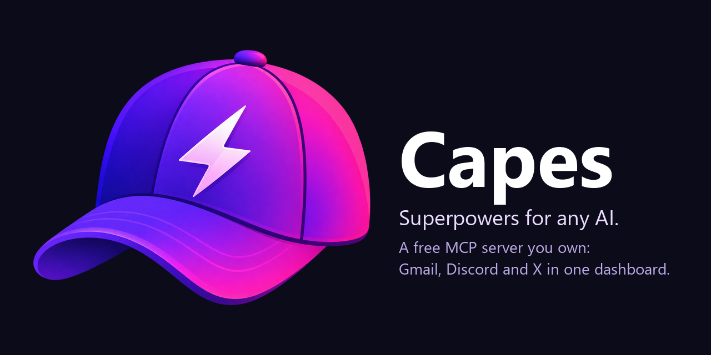
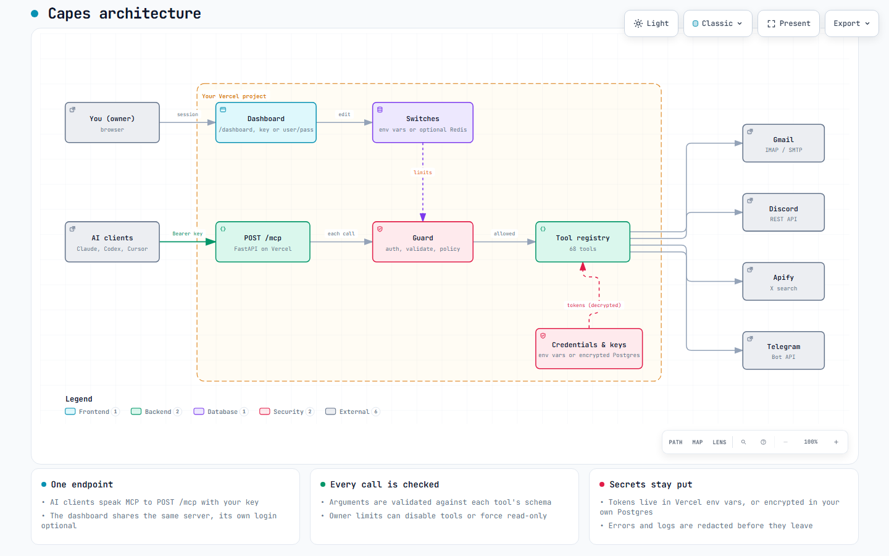
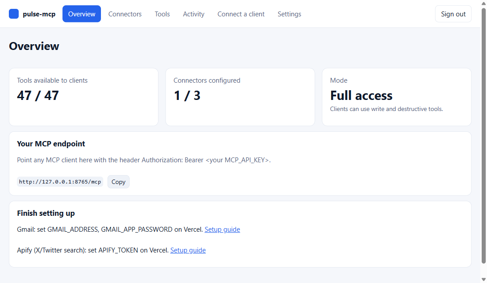
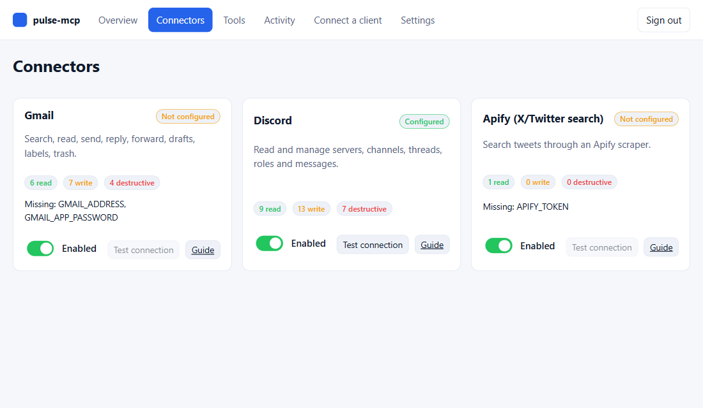
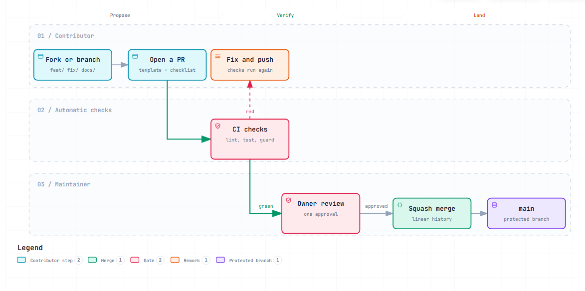

<div align="center">



<br>

### Give Claude, Codex, Cursor and any MCP client hands: your Gmail, Discord and X, through one private server you own.

[](https://github.com/Dipeshpal/capes/actions/workflows/ci.yml) [](LICENSE)     [](https://github.com/Dipeshpal/capes)

[](https://vercel.com/new/clone?repository-url=https%3A%2F%2Fgithub.com%2FDipeshpal%2Fcapes&env=MCP_API_KEY&envDescription=MCP_API_KEY%20is%20any%20long%20random%20string%20you%20make%20up%20(24%2B%20characters).%20It%20is%20the%20only%20required%20variable%3B%20add%20service%20credentials%20on%20this%20same%20screen%20or%20afterward.&envLink=https%3A%2F%2Fgithub.com%2FDipeshpal%2Fcapes%2Fblob%2Fmain%2Fdocs%2Fsetup%2Fvercel.md&project-name=capes&repository-name=capes)

<table>
  <tr>
    <td align="right"><b>🚀 Start</b></td>
    <td align="center"><a href="#-quick-start">Quick start</a></td>
    <td align="center"><a href="#-deploy">Deploy</a></td>
    <td align="center"><a href="#-connect-your-ai-client">Connect a client</a></td>
  </tr>
  <tr>
    <td align="right"><b>💡 Learn</b></td>
    <td align="center"><a href="#-what-you-get">What you get</a></td>
    <td align="center"><a href="#-a-day-with-capes">A day with Capes</a></td>
    <td align="center"><a href="#-how-it-works">How it works</a></td>
  </tr>
  <tr>
    <td align="right"><b>⚙️ Reference</b></td>
    <td align="center"><a href="#-services-and-credentials">Services</a></td>
    <td align="center"><a href="#-the-dashboard">Dashboard</a></td>
    <td align="center"><a href="#-tools">All 68 tools</a></td>
  </tr>
  <tr>
    <td align="right"><b>💬 Community</b></td>
    <td align="center"><a href="#-whats-built">What's built</a></td>
    <td align="center"><a href="#-whats-next">What's next</a></td>
    <td align="center"><a href="#-request-a-feature-or-a-new-mcp-connector">Request a feature</a> · <a href="#-support-the-project">☕ Support</a></td>
  </tr>
  <tr>
    <td align="right"><b>🤝 Project</b></td>
    <td align="center"><a href="#-security">Security</a></td>
    <td align="center"><a href="#-contributing">Contributing</a></td>
    <td align="center"><a href="#-documentation">Documentation</a></td>
  </tr>
</table>

</div>

## 🎬 Demo

<div align="center">

[](https://youtu.be/5UdGxXCC8WY)

**[▶ Watch the demo on YouTube](https://youtu.be/5UdGxXCC8WY)**

</div>

Fresh Vercel deploy, checking connectors, browsing all 68 tools, connecting a client, and asking Claude to use it.

## ✨ What you get

AI assistants read, summarise and act well, but your real work lives in accounts they cannot reach. Capes is **one private [MCP](https://modelcontextprotocol.io/docs/getting-started/intro) server** that you deploy to your own Vercel account. Connect it once and the same tools appear in every AI client you use.

| | What it does |
|---|---|
| 📧 **Gmail** (17 tools) | Search with Gmail syntax, read, send, reply, forward, drafts, labels, archive, trash. No Google Cloud project, just an app password. |
| 💬 **Discord** (47 tools) | Read and post, edit, delete, react, threads, forums, polls, files, webhooks, channels, roles, permissions, moderation, audit log. |
| 🐦 **X / Twitter** (1 tool) | Search tweets through an Apify scraper. |
| ✈️ **Telegram** (3 tools) | Send messages, get chat info, poll recent updates. |
| 🖥️ **Dashboard** | Test each service's credentials, browse and try the tools, watch recent activity, copy ready-made client config. |
| 🛡️ **Limits you control** | Turn a service or a single tool off, or make the whole server read-only. Tools are labelled read, write or destructive. |
| 🔑 **You own it** | Your credentials live only in your Vercel project. No central service, no account with us, no database. |

## 🎬 A day with Capes

Sam runs a small product and its Discord community, and answers customers from one Gmail inbox. Every morning Sam asks one question in Claude:

> **Sam:** Give me a briefing. Unread customer emails from the last day, unanswered questions in #support, and what people are saying about our product on X.

The assistant, using tools from the same server:

1. `gmail_search` for `is:unread newer_than:1d`, then `gmail_get_message` on the ones that look like customers. It groups them: 3 billing questions, 1 bug report, 2 newsletters.
2. `discord_read_channel` on #support, and finds 4 questions nobody answered.
3. `twitter_search` for the product name, and summarizes the tone of 20 recent tweets.

> **Sam:** Draft replies to the billing emails, and answer the two easy Discord questions. Show me everything before you send.

4. `gmail_create_draft` for each reply (drafts, nothing sent yet).
5. Shows Sam the drafts and the two Discord answers. Sam approves.
6. `gmail_send_draft`, `discord_send_message`, and `gmail_modify` to label and archive the handled mail.

That is about five minutes instead of forty, and the assistant never had direct access to Sam's accounts: everything went through Sam's own server, with Sam's own limits. When Sam wants an assistant to only look, one switch in the dashboard hides every tool that sends or deletes.

*This is an illustration of what the tools make possible, not a recording.*

<details>
<summary><b>Why not just use each app's built-in connectors?</b></summary>

- **One setup for every client.** The same server works in Claude Desktop, Claude Code, Cursor and Codex, not just one app.
- **You hold the credentials.** They sit in your own Vercel project, not in a third-party platform.
- **You set the limits.** Switch connectors and single tools off, or make the whole server read-only, and see what was called.
- **Free to run** for personal use, and easy to extend with your own tools.

Other ways to solve this exist (hosted platforms like Composio, gateways like MetaMCP, single-service MCP servers). A short comparison is in [What Capes is for](docs/project/architecture.md#how-it-compares).

</details>

## 🧭 How it works

<div align="center">



</div>

Your server exposes `POST /mcp`, protected by a secret key you create (`MCP_API_KEY`), and a dashboard at `/dashboard` that you sign in to with the same key (no database, no accounts). Every call passes a guard that checks the key, validates the arguments and applies your limits before a tool runs. The service credentials (Gmail app password, Discord bot token, Apify token) are Vercel environment variables and never leave your project.

**Interactive diagrams** (pan, zoom, search, trace a path): [architecture](docs/diagrams/architecture.html), [life of a tool call](docs/diagrams/request-lifecycle.html) and [how a change reaches main](docs/diagrams/contribution-flow.html). GitHub shows an HTML file as source, so click the link, choose **Download raw file** (the download icon), and open the file in your browser. It is self-contained and works offline.

## 🚀 Quick start

About 20 minutes, most of it creating credentials. Skip any service you do not need.

| # | Step | Where | Time |
|---|------|-------|------|
| 1 | Create a free Vercel account and your `MCP_API_KEY` | [Vercel guide](docs/setup/vercel.md) | 3 min |
| 2 | Get credentials for the services you want | [Discord](docs/setup/discord.md), [Gmail](docs/setup/gmail.md), [Apify](docs/setup/apify.md) guides | 3 to 10 min each |
| 3 | **Deploy on Vercel** and paste your key and credentials | [Deploy](#-deploy) | 3 min |
| 4 | Open `/dashboard`, sign in, click **Test connection** on each connector; invite your Discord bot with **Connectors > Discord > Get invite link** (built from your token, nothing to copy) | your browser | 3 min |
| 5 | Connect your AI client and ask "List my Discord channels" | Claude, Codex, Cursor | 2 min |

## 🔌 Services and credentials

Click a guide for the exact steps, permissions and limits of each service.

| Service | What it unlocks | What you need | Where to get it | Setup guide |
|---------|-----------------|---------------|-----------------|-------------|
| **Vercel** (required) | Hosts your server and dashboard (free Hobby plan) | A Vercel account and a key you invent, `MCP_API_KEY` (24+ characters) | [vercel.com/signup](https://vercel.com/signup) | [Vercel setup](docs/setup/vercel.md) |
| **Gmail** | Read, send and organize email (free, no Google Cloud project) | `GMAIL_ADDRESS` and an app password `GMAIL_APP_PASSWORD` | [Google app passwords](https://myaccount.google.com/apppasswords) | [Gmail setup](docs/setup/gmail.md) |
| **Discord** | Read and manage servers, channels, messages, roles | Bot token `DISCORD_BOT_TOKEN`, bot invited with permissions | [Developer Portal](https://discord.com/developers/applications) | [Discord setup](docs/setup/discord.md) |
| **Apify** (for X/Twitter) | Search tweets | API token `APIFY_TOKEN` | [Apify API settings](https://console.apify.com/settings/integrations) | [Apify setup](docs/setup/apify.md) |
| **Telegram** | Send messages, read chats, poll updates | Bot token `TELEGRAM_BOT_TOKEN` | [@BotFather](https://t.me/BotFather) | [Telegram setup](docs/setup/telegram.md) |
| *Database* | **Not needed.** Nothing is stored on the server. | (Advanced, optional: a free Redis via `vercel integration add upstash` lets the dashboard flip switches without redeploying.) | [Vercel Marketplace](https://vercel.com/marketplace/upstash) | [Dashboard guide](docs/usage/dashboard.md#switches-read-only-mode-and-where-settings-are-stored) |

Only `MCP_API_KEY` is required. A tool whose credentials are missing returns a clear message instead of failing.

## ☁️ Deploy

### Option A: deploy on Vercel (recommended)

No install, no terminal.

[](https://vercel.com/new/clone?repository-url=https%3A%2F%2Fgithub.com%2FDipeshpal%2Fcapes&env=MCP_API_KEY&envDescription=MCP_API_KEY%20is%20any%20long%20random%20string%20you%20make%20up%20(24%2B%20characters).%20It%20is%20the%20only%20required%20variable%3B%20add%20service%20credentials%20on%20this%20same%20screen%20or%20afterward.&envLink=https%3A%2F%2Fgithub.com%2FDipeshpal%2Fcapes%2Fblob%2Fmain%2Fdocs%2Fsetup%2Fvercel.md&project-name=capes&repository-name=capes)

1. Click the button and sign in to Vercel. It copies the repository into your GitHub account.
2. Paste your `MCP_API_KEY` ([how to make one](docs/setup/vercel.md#2-create-your-mcp_api_key)). It's the only variable Vercel requires here. If you already have credentials for Discord, Gmail or Apify, click **Add More** on the same screen and add them now; otherwise add them afterward in **Settings > Environment Variables** and redeploy — Vercel forces every variable listed in the button's link to be filled in, so listing the optional ones there would block you from deploying without them.
3. Click **Deploy**, then open `https://<project>.vercel.app/dashboard` and sign in with your key.

The button works for anyone once the repository is public. Before that, or from a fork, use **Vercel > Add New > Project > Import Git Repository**, choose the repo and add the same variables. Details, Deployment Protection and key rotation: [Vercel guide](docs/setup/vercel.md).

### Option B: one command from your computer

Needs [Node.js 18+](https://nodejs.org). It logs you in to Vercel, generates a strong key, asks for your credentials (Enter skips any), deploys, connects your AI clients and prints your Discord invite link:

```bash
git clone https://github.com/Dipeshpal/capes.git
cd capes
node scripts/capes.mjs install
```

Your address and key are saved to `.capes.local.json` (git-ignored). Non-interactive: `node scripts/capes.mjs install --name my-capes --discord TOKEN --apify TOKEN --gmail you@gmail.com --gmail-password APP_PASSWORD --clients desktop,cursor`.

### Option C: Vercel CLI by hand

Step by step in the [Vercel guide](docs/setup/vercel.md#option-c-vercel-cli-by-hand).

## 🖥️ The dashboard

Open `https://<project>.vercel.app/dashboard` and sign in with your `MCP_API_KEY`.

<table>
  <tr>
    <td width="50%"></td>
    <td width="50%"></td>
  </tr>
  <tr>
    <td align="center"><sub><b>Overview</b>: what clients can see and your endpoint</sub></td>
    <td align="center"><sub><b>Connectors</b>: test credentials, get the Discord invite link</sub></td>
  </tr>
</table>

- **Overview, Connectors, Tools:** what is connected and which tools clients can see.
- **Test connection:** a read-only check of each service's credentials.
- **Limits:** turn a service or a single tool off, or hide everything that changes data. No database needed: set `PULSE_READ_ONLY`, `PULSE_DISABLED_CONNECTORS` or `PULSE_DISABLED_TOOLS` on Vercel (an optional free Redis lets you flip these on the dashboard without redeploying).
- **Try:** run read-only tools with a form.
- **Activity:** recent calls, without arguments or results.
- **Connect a client:** copy-ready config for Claude, Cursor and Codex.

Full walkthrough and security details: [Dashboard guide](docs/usage/dashboard.md).

## 🤖 Connect your AI client

Every client needs your address `https://<project>.vercel.app/mcp` and your `MCP_API_KEY` as `Authorization: Bearer <key>`. The dashboard's **Connect a client** tab shows the exact config. Or, from a clone of the repo:

```bash
node scripts/capes.mjs connect        # configures Claude Desktop, Claude Code, Cursor, Codex
```

By hand, per client ([client guide](docs/setup/clients.md)):

| Client | How it connects | Guide |
|--------|-----------------|-------|
| Claude Desktop | `mcp-remote` bridge in `claude_desktop_config.json` | [Claude Desktop](docs/setup/clients.md#claude-desktop) |
| Claude Code | `claude mcp add --transport http ...` | [Claude Code](docs/setup/clients.md#claude-code) |
| Cursor | `url` and `headers` in `~/.cursor/mcp.json` | [Cursor](docs/setup/clients.md#cursor) |
| Codex | `codex mcp add ... --bearer-token-env-var` | [Codex](docs/setup/clients.md#codex) |
| Anything else | Streamable HTTP with the Bearer header | [Other clients](docs/setup/clients.md#any-other-mcp-client) |

Restart the client after connecting so it loads the tools.

## 💬 Using it

Once connected, just talk to your assistant and it picks the tools:

- "How many unread emails do I have? Summarize the five newest."
- "Draft a reply to the last email from Sam. Show me before sending."
- "Read the last 50 messages in #support and list the open questions."
- "Post the release notes in #announcements and pin them."
- "Search X for people talking about MCP servers."

Sending mail and messages cannot be undone, so ask for a draft first when it matters. [Using Capes](docs/usage/usage.md) has more examples and safety habits.

## 🧰 Tools

68 tools. The lists below are the quick view; [docs/usage/tools.md](docs/usage/tools.md) is the generated reference with every tool's description, kind and arguments.

<details>
<summary><b>📧 Gmail (17)</b></summary>

`gmail_search`, `gmail_get_message`, `gmail_get_thread`, `gmail_get_attachment`, `gmail_list_labels`, `gmail_send_email` (HTML, cc/bcc, attachments), `gmail_reply` (reply-all, quoted original), `gmail_forward`, `gmail_create_draft`, `gmail_list_drafts`, `gmail_send_draft`, `gmail_delete_draft`, `gmail_modify` (read/unread, star, archive, labels), `gmail_trash`, `gmail_mark_spam`, `gmail_create_label`, `gmail_delete_label`

</details>

<details>
<summary><b>💬 Discord (47)</b></summary>

**Read**: `discord_list_guilds`, `discord_get_guild`, `discord_list_channels`, `discord_get_channel` (with permission overwrites), `discord_read_channel`, `discord_get_message`, `discord_list_pins`, `discord_list_reactions`, `discord_list_members` (search too), `discord_list_roles`, `discord_list_emojis`, `discord_list_scheduled_events`, `discord_list_threads`, `discord_list_invites`, `discord_get_audit_log`, `discord_read_dm`

**Messages**: `discord_send_message` (text, embeds, replies), `discord_send_dm`, `discord_send_file` (base64 upload), `discord_create_poll`, `discord_edit_message`, `discord_delete_message`, `discord_bulk_delete_messages`, `discord_pin_message`, `discord_add_reaction`, `discord_remove_reaction`

**Channels and threads**: `discord_create_channel` (text, voice, category, announcement, stage, forum, private), `discord_edit_channel` (also renames, archives and locks threads), `discord_delete_channel`, `discord_set_channel_permission`, `discord_delete_channel_permission`, `discord_create_invite`, `discord_delete_invite`, `discord_create_thread` (from a message, standalone, private, or forum post with tags), `discord_thread_member`

**Forums and webhooks**: `discord_list_forum_tags`, `discord_manage_forum_tag`, `discord_list_webhooks`, `discord_create_webhook`, `discord_send_webhook_message` (the webhook token never leaves the server), `discord_delete_webhook`

**Roles and moderation**: `discord_create_role`, `discord_edit_role`, `discord_delete_role`, `discord_member_role`, `discord_set_nickname`, `discord_moderate_member` (kick, ban, unban, timeout)

</details>

<details>
<summary><b>🐦 X / Twitter (1)</b></summary>

`twitter_search`

</details>

<details>
<summary><b>✈️ Telegram (3)</b></summary>

`telegram_send_message`, `telegram_get_chat`, `telegram_get_updates`

</details>

Tools are flagged read, write or destructive so clients can ask before risky calls, and you can switch any of them off in the dashboard. Discord channel and thread IDs are interchangeable wherever a `channel_id` is asked for.

## ✅ Check that it works

1. Open `/dashboard`, sign in, and click **Test connection** on each connector.
2. Or `curl https://<project>.vercel.app/health` returns `"status":"online"`.
3. In your AI client, ask "List my Discord channels" (Discord), "How many unread emails do I have?" (Gmail) or "Search X for MCP servers" (Apify).
4. Something wrong? [Troubleshooting](docs/usage/troubleshooting.md) maps every common error to its fix.

## 🏁 What's built

- [x] **68 tools across four services:** Gmail (17), Discord (47), X search (1) and Telegram (3). The Discord toolkit covers messages, DMs, files, polls, threads, forums, webhooks, channels, roles, permissions, moderation, invites and the audit log.
- [x] **Owner dashboard:** sign in with your key, test each connector, browse the tools, try read-only ones, watch activity, copy client config, and generate your Discord invite link in one click.
- [x] **One-click deploy to your own Vercel** (Deploy button or one installer command), no database needed.
- [x] **Works in Claude Desktop, Claude Code, Cursor and Codex** (and any client that speaks MCP over HTTP).
- [x] **Limits you control:** switch a service or a single tool off, or make the whole server read-only. Every tool is labelled read, write or destructive.
- [x] **Built to be safe:** arguments validated against each tool's schema, secrets redacted from errors and logs, signed dashboard sessions with CSRF protection, rate-limited sign-in, fail-closed settings.
- [x] **Tested without credentials:** a fake IMAP server and a fake Discord API server exercise the tools in CI. Most Discord tools were also run against a real test server; one of 33 checks failed on the first run, and it was a real bug (pinning needs the separate Pin Messages permission), which is fixed. The maintainer has since tested it on a real community server too.
- [x] **Open-source ready:** MIT license, contributor guard against unreviewed changes to CI and assistant settings, protected `main` (pull request, code-owner review and green checks), secret scanning, docs with diagrams.

## 🗺️ What's next

Ideas, not promises. What you ask for moves up the list, so [tell us what you need](#-request-a-feature-or-a-new-mcp-connector).

- [x] **Discord: scheduled events, emoji listing, nicknames.** Community-contributed ([#25](https://github.com/Dipeshpal/capes/pull/25), [#26](https://github.com/Dipeshpal/capes/pull/26)) plus `discord_set_nickname`. Still open: application commands, stickers.
- [x] **A second connector: Telegram.** Send messages, read chat info, poll updates ([#33](https://github.com/Dipeshpal/capes/pull/33)). More services welcome — [claim one](https://github.com/Dipeshpal/capes/issues/23).
- [x] **A short demo video** of an assistant using the tools, linked at the top of this README.
- [x] **A fresh-account walkthrough** of the README and Deploy button. Found and fixed a real bug: the button listed optional service credentials as required, contradicting "leave them empty" ([#31](https://github.com/Dipeshpal/capes/pull/31)).
- [x] **v1.0.0 tagged release**, with [release notes](https://github.com/Dipeshpal/capes/releases/tag/v1.0.0).
- [ ] **Per-client keys and scopes,** so one assistant can be read-only while another is not. Design posted for discussion in [#24](https://github.com/Dipeshpal/capes/issues/24); implementation not started.
- [ ] **Verify the optional Redis settings** on a real Upstash database (today they are tested against a fake server) — [in progress](https://github.com/Dipeshpal/capes/issues/22).
- [ ] **Multiple accounts per service** (for example two mailboxes).
- [ ] **More connectors:** calendar, chat and notes tools are natural next candidates.

The design notes and known limits are in [What Capes is for](docs/project/architecture.md#known-limits).

## 📬 Request a feature or a new MCP connector

Want your assistant to reach another service, or a tool that is missing?

**[Open a feature request](https://github.com/Dipeshpal/capes/issues/new?template=feature_request.md)** and tell us:

- what you want to be able to ask your assistant to do,
- for a new service: its API docs, how a user gets credentials (token, app password, OAuth), whether it is free for personal use, and whether it works over plain HTTP from a short-lived serverless function,
- the tools you would like (name, what it does, read, write or destructive),
- whether you plan to build it yourself.

Want to build it? A new tool is one Python function; a whole service is a small module. Start with [Contributing](docs/project/contributing.md#add-a-service). Found a bug instead? [Report it](https://github.com/Dipeshpal/capes/issues/new?template=bug_report.md). Security problems go to [SECURITY.md](SECURITY.md), not a public issue.

## ☕ Support the project

Capes is free and open source, built and maintained in spare time. If it saves you time, a coffee helps keep it going.

[](https://buymeacoffee.com/dipeshpal)

Starring the repo, sharing it, fixing a typo or sending a pull request helps just as much.

## 🛡️ Security

Capes holds real credentials, so it is built to be strict by default.

| Guarantee | How |
|-----------|-----|
| **One key guards everything** | `MCP_API_KEY` (24+ characters, checked in constant time) protects `/mcp` and the dashboard. Anyone who has it can read your email and act through your Discord bot, so keep it secret and rotate it if in doubt ([how](docs/setup/vercel.md#rotating-the-key)). |
| **Credentials stay in your Vercel project** | Never commit `.env*` or `.capes.local.json` (git-ignored). The dashboard and tool results never show secret values. |
| **Strict by default** | Arguments are validated before any call, dashboard sessions are signed cookies with CSRF protection, and Redis outages fail closed into read-only mode. |
| **Contributors cannot slip in behaviour changes unnoticed** | CI blocks hooks, wildcard permissions, hidden text, unapproved dependencies and risky workflows, hash-pins every executable file under `.claude/` and `.github/`, and `CODEOWNERS` routes sensitive paths to the maintainer. Nobody pushes to `main` directly. |
| **If a token leaks** | Rotate it at the provider (Discord: Reset Token; Apify: regenerate; Google: delete the app password) and update Vercel. |

Details in [SECURITY.md](SECURITY.md) and the [security model](docs/project/architecture.md#security-model).

## 🤝 Contributing

Anyone can contribute: fix a bug, sharpen a guide, add a tool, or improve the dashboard. **Only the maintainer merges.** Nobody pushes to `main`; every change goes through a pull request that passes the checks and gets a code-owner review ([Governance](docs/project/governance.md)).

<div align="center">



</div>

1. Read [What Capes is for](docs/project/architecture.md) and [Contributing](docs/project/contributing.md).
2. Fork, branch (`feat/...`, `fix/...`, `docs/...`), make one focused change.
3. Run the checks (no credentials needed; the full list is in [Contributing](docs/project/contributing.md#checks)):

   ```bash
   uv run --with fastapi --with aiohttp --with python-dotenv --with httpx python tests/protocol.py
   uv run --with fastapi --with aiohttp --with python-dotenv --with httpx python tests/dashboard.py
   uv run --with fastapi --with aiohttp --with python-dotenv python tests/gmail_offline.py
   python tests/claude_config.py
   uvx ruff check . && uvx ruff format --check .
   ```

4. Open a pull request using the template. Say what you tested and what you could not. CI runs the same checks, a guard for assistant/CI configuration, and a secret scan.

Adding a tool takes one Python function:

```python
# pulse/hello.py  (then import it in api/index.py)
from .registry import tool

@tool("hello", "Say hello", {"name": {"type": "string"}}, ["name"], hint="read")
async def hello(args: dict):
    return {"message": f"Hello {args['name']}"}
```

Changes to `.claude/`, `.github/`, `scripts/`, authentication code, `vercel.json` or dependencies always need the maintainer's review (see [Security](#-security)).

<details>
<summary><b>🧠 The <code>.claude</code> folder: the repo ships its own Claude Code setup</b></summary>

A contributor's assistant knows the project from the first prompt:

| Path | What it gives you |
|------|-------------------|
| [`CLAUDE.md`](CLAUDE.md) | Overview, commands, conventions, gotchas and security rules, loaded in every session |
| [`.claude/rules/`](.claude/rules) | Focused rules that load when you touch matching files (tools, dashboard, Discord, Gmail, installer, docs, GitHub) plus always-on security rules |
| [`.claude/skills/`](.claude/skills) | Slash commands: `/add-tool`, `/run-tests`, `/deploy`, `/security-audit` |
| [`.claude/agents/tool-reviewer.md`](.claude/agents/tool-reviewer.md) | A reviewer subagent for tool changes, with shared memory in [`.claude/agent-memory/`](.claude/agent-memory/tool-reviewer/MEMORY.md) |
| [`.claude/settings.json`](.claude/settings.json) | Shared permissions: safe commands allowed; reading secret files and force pushes denied |

With Claude Code: run `claude` in the repo, then for example `/add-tool slack slack_send_message`, `/run-tests`, and ask `@tool-reviewer` to review your diff. What each file does is in [docs/project/contributing.md](docs/project/contributing.md#the-claude-folder).

</details>

## 📚 Documentation

Everything is indexed in [docs/README.md](docs/README.md).

| | |
|---|---|
| **🚀 Setup** | [Vercel](docs/setup/vercel.md) · [Discord](docs/setup/discord.md) · [Gmail](docs/setup/gmail.md) · [Apify](docs/setup/apify.md) · [Connect your client](docs/setup/clients.md) |
| **📖 Use** | [Dashboard](docs/usage/dashboard.md) · [Using Capes](docs/usage/usage.md) · [Tool reference](docs/usage/tools.md) · [Troubleshooting](docs/usage/troubleshooting.md) |
| **🤝 Understand and contribute** | [What Capes is for](docs/project/architecture.md) · [Contributing](docs/project/contributing.md) · [Governance: who can merge](docs/project/governance.md) · [Security policy](SECURITY.md) · [Release checklist](docs/project/release-checklist.md) |

## 📄 License

[MIT](LICENSE). Use it, change it and share it; keep the copyright notice. It comes with no warranty, so you are responsible for what your AI assistants do with your mailbox and servers.

## 🔗 References

- [Model Context Protocol: introduction](https://modelcontextprotocol.io/docs/getting-started/intro) and [connecting Claude Code to MCP servers](https://code.claude.com/docs/en/mcp)
- [Claude Code directory layout](https://code.claude.com/docs/en/claude-directory), which the `.claude/` folder follows
- [Discord developer documentation](https://discord.com/developers/docs/intro)
- [Gmail IMAP extensions](https://developers.google.com/workspace/gmail/imap/imap-extensions) (search syntax, labels, threads) and [Google app passwords](https://support.google.com/accounts/answer/185833)
- [Apify Tweet Scraper](https://apify.com/apidojo/tweet-scraper), the default actor behind `twitter_search`
- [Vercel Functions](https://vercel.com/docs/functions) and the [Upstash Redis integration](https://vercel.com/marketplace/upstash)
- Inspiration: [kebab-mcp](https://github.com/Yassinello/kebab-mcp) showed how useful a dashboard on a personal Vercel MCP server can be. Capes's dashboard is an independent implementation written from scratch. The README layout draws on the structure of other well-presented open-source READMEs; the wording and content here are our own.
