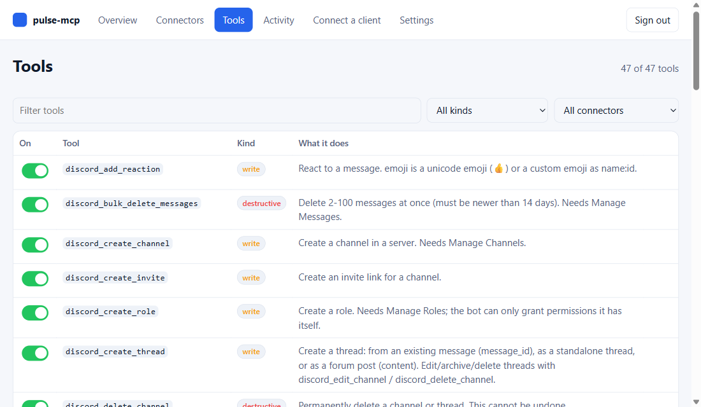

# The dashboard

Every deployment includes a web dashboard at `https://<project>.vercel.app/dashboard`. Use it to see what is connected, test your credentials, switch connectors and tools on or off, run read-only tools, watch recent activity, and copy the config for your AI client. There is nothing to install and no build step; it is served by your own server.

## Signing in

Open `/dashboard` (browsers opening the plain address are sent there) and enter your `MCP_API_KEY`, the same key your AI clients use. There are no separate accounts or passwords.

- The key is never stored in the browser. On success the server sets a **signed session cookie** (HttpOnly, Secure, SameSite=Strict) that lasts 8 hours by default (`PULSE_SESSION_HOURS` changes it, 1 to 168).
- After that you simply sign in again with the same key. **You never need to rotate the key on a schedule.** Change it only if you think it leaked; doing so also ends every session.
- Sessions end when you click **Sign out** or when the time is up.
- After 10 wrong attempts from one address, sign-in is blocked for 15 minutes.
- If sign-in says the key is too short, your `MCP_API_KEY` is under 24 characters. Set a stronger one ([how](vercel.md#2-create-your-mcp_api_key)).

## What each tab does

| Tab | What you can do |
|-----|-----------------|
| **Overview** | See tools available to clients, connectors configured, the current mode (full access or read-only), your MCP endpoint address (with a copy button), and what still needs setup. |
| **Connectors** | One card per service (Gmail, Discord, Apify). Shows whether its credentials are set, how many read/write/destructive tools it has, a **Test connection** button, an enable switch, and a link to its setup guide. The Discord card also has **Get invite link**: it builds the bot's invite URL (with the right permissions) from your token, so you do not need the Application ID. |
| **Tools** | Every tool with its kind and description. Filter by text, kind or connector. Switch individual tools off. **Try** runs a read-only tool with a small form. |
| **Activity** | The last calls: time, tool, whether it came from a client or the dashboard, success or error. Tool names and outcomes only, never arguments or results. |
| **Connect a client** | Ready-to-copy config for Claude Code, Claude Desktop, Cursor and Codex, filled in with your endpoint address. The key is never shown; you replace `YOUR_MCP_API_KEY` yourself. |
| **Settings** | Read-only mode, the state of settings storage, and sign out. |

### Test connection

The button makes one harmless, read-only call with the credentials you set on Vercel: it signs in to Gmail and checks the inbox, asks Discord who the bot is and how many servers it is in, or asks Apify for your account. It shows what worked or the exact error. It never shows a secret.

### Try a tool

**Try** is available for read-only tools only, and it goes through the same checks as an AI client (argument validation, disabled tools, read-only mode). Write and destructive tools cannot be run from the dashboard.

## Switches, read-only mode, and where settings are stored

**You do not need a database or Redis.** Everything below works with environment variables alone; Redis only adds live switches and a durable activity log.

You can restrict what AI clients may do in three ways:

1. **Connector switch**: turn a whole service off (its tools disappear from clients).
2. **Tool switch**: turn single tools off, for example `gmail_trash` or `discord_moderate_member`.
3. **Read-only mode**: hides every tool that sends, changes or deletes anything. Assistants can look but never act.

Disabled tools are removed from what clients see and are refused if called anyway.

Where the choices live depends on your setup:

| Setup | What happens |
|-------|--------------|
| **With Redis** (optional and advanced: `vercel integration add upstash`, free) | Switches on the dashboard work and are saved. A change reaches clients within about 10 seconds. The activity log is kept for the last 100 calls. |
| **Without Redis** (the normal setup, no database at all) | Nothing is stored on the server. The dashboard shows the current state and you restrict clients with environment variables on Vercel: `PULSE_READ_ONLY=1`, `PULSE_DISABLED_CONNECTORS=discord,apify`, `PULSE_DISABLED_TOOLS=gmail_trash,...`. Activity is kept in memory on the server instance only and resets when it restarts. |

Environment restrictions always win. Anything set by an environment variable shows as **locked** and cannot be switched back on from the dashboard, so you can pin a safe baseline that no session can loosen.

If Redis is configured but unreachable, the server keeps using the last settings it knew. If it has none yet, it **fails closed** into read-only mode instead of silently allowing writes. The Overview tab shows a warning while this is the case.

## Security in short

- One key, checked in constant time. Keys under 24 characters are refused.
- Signed cookie session, per-session CSRF token on every change, same-origin checks, and `Content-Type: application/json` required on changes.
- Strict Content-Security-Policy: no inline scripts or styles, nothing loaded from other websites, no framing. All data is inserted as text, never as HTML.
- The dashboard API never returns secret values, only whether a variable is set.
- Every response carries `nosniff`, `no-referrer`, `frame-ancestors 'none'` and `no-store` headers, plus HSTS over HTTPS.

The full model is in [What pulse-mcp is for](architecture.md#security-model). Report problems privately as described in [SECURITY.md](../SECURITY.md).

## Troubleshooting

| Symptom | Fix |
|---------|-----|
| "That key is not correct" | Use the value of `MCP_API_KEY` from Vercel. Check for stray spaces. |
| "Too many attempts" | Wait 15 minutes. |
| Sign-in fails with a server error about key length | `MCP_API_KEY` is shorter than 24 characters. Change it and redeploy. |
| Switches are greyed out | That is normal without Redis: limits come from environment variables. See [switches](#switches-read-only-mode-and-where-settings-are-stored). |
| Saved a switch but a client still sees the tool | Wait about 10 seconds, then restart the client so it re-reads the tool list. |
| Signed out again | Sessions last 8 hours by default (`PULSE_SESSION_HOURS`), and end early only if `MCP_API_KEY` was changed. Just sign in again. |
| Test connection fails | Read the message: it comes from the service (wrong token, missing permission). See that service's guide. |
| Dashboard shows a Vercel login page | Deployment Protection is on ([fix](vercel.md#deployment-protection)). |

## For contributors

The dashboard is plain HTML, CSS and JavaScript in [`dashboard/`](../dashboard), served by `pulse/dashboard.py`. Rules to keep it secure are in `.claude/rules/dashboard.md` and enforced by `tests/dashboard.py`: no inline scripts or styles, no `innerHTML`, nothing loaded from other origins, no browser storage. A new connector appears in the dashboard automatically once it is listed in `pulse/connectors.py`.
