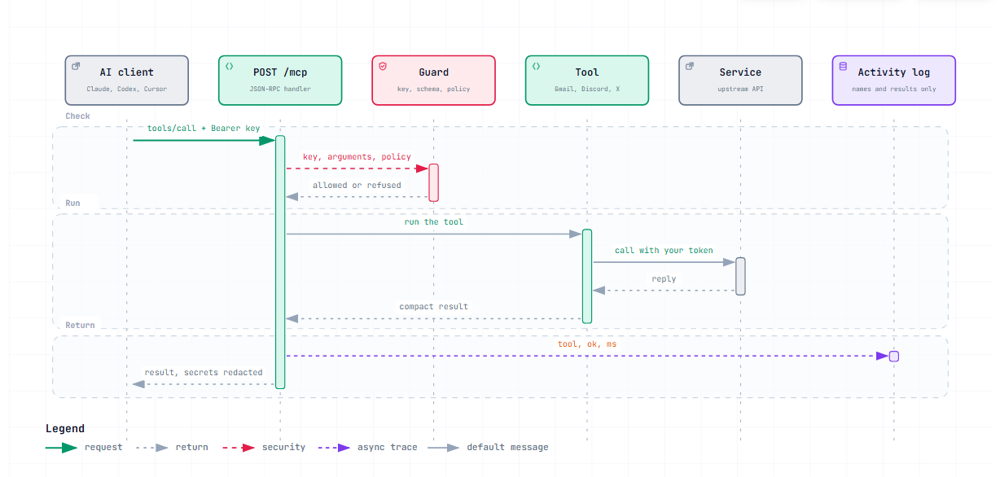

# What Capes is for, and how it works

## The goal

AI assistants are good at reading, summarizing and acting, but your real work lives in accounts they cannot reach: your inbox, your community chat, your social feeds. Capes is a small server that gives an assistant controlled access to **your own** accounts through one standard door (the [Model Context Protocol](https://modelcontextprotocol.io/docs/getting-started/intro)), so the same setup works in Claude, Codex, Cursor and any other MCP client.

What we are trying to achieve:

1. **Personal and private.** You deploy your own copy to your own Vercel account. There is no central service, no shared database and no one else's server between you and your data. Your credentials sit in your own Vercel project.
2. **Easy to set up.** Deploy from your browser, then a click-by-click guide per service. A person who has never used MCP should be running in about 20 minutes.
3. **Useful by default.** Full toolkits, not toys: Gmail (search, read, send, draft, organize), Discord (read, write, manage, moderate), X search. Anything you can do by hand in these accounts, an assistant can do for you.
4. **Under your control.** A dashboard shows what is connected and lets you switch connectors and tools off or make the server read-only. Tools are labelled read, write or destructive so clients ask before risky calls.
5. **Free to run.** Vercel Hobby, Gmail app passwords, the Apify free plan and a free Redis cover personal use.
6. **Easy to extend and safe to contribute to.** A new tool is one Python function. Contributors get a ready-made Claude Code setup (`.claude/`), and CI blocks changes that would quietly alter what assistants or the pipeline can do.

Not goals: a multi-user SaaS, storing your data anywhere, replacing the official apps, providing self-hosted Docker or local-server options for end users (deployment is Vercel only), or working around the terms of the services it connects to.

## How a request flows


The interactive version (pan, zoom, trace paths) is [architecture.html](../diagrams/architecture.html); download it and open it in a browser.



Interactive: [request-lifecycle.html](../diagrams/request-lifecycle.html). The same flow as text:

```
 AI client (Claude, Codex, Cursor)                     you, in a browser
        |  MCP over HTTPS                                     |  HTTPS, session cookie
        |  Authorization: Bearer <MCP_API_KEY>                |
        v                                                     v
 your Vercel project: api/index.py  (FastAPI)  ------  /dashboard (pulse/dashboard.py + dashboard/)
        |  POST /mcp: verify key, then JSON-RPC (initialize, tools/list, tools/call)
        v
 pulse/mcp.py : validate arguments -> apply owner policy (pulse/store.py) -> run tool -> log outcome
        |
        +--> pulse/gmail.py    --> imap/smtp.gmail.com   (app password)
        +--> pulse/discord.py  --> Discord REST API      (bot token)
        +--> pulse/twitter.py  --> Apify API             (Apify token)

 pulse/store.py --> optional Redis (Upstash): settings, activity log, rate-limit counters
```

Each call is independent (stateless). The server holds no data between calls except what you put in the optional Redis. Credentials are read from environment variables inside the tool that needs them, so a missing one only disables that service.

## Components

| Path | Role |
|------|------|
| `api/index.py` | The web app: API-key check for `/mcp`, security headers, health check, `/` routing |
| `pulse/mcp.py` | MCP core: JSON-RPC, argument validation against each tool's schema, policy enforcement, activity logging |
| `pulse/registry.py` | The `@tool(...)` decorator, `ToolError`, and read/write/destructive labels |
| `pulse/security.py` | Key check, session cookies, CSRF, origin checks, security headers |
| `pulse/store.py` | Owner settings (environment plus optional Redis), activity log, rate limiting |
| `pulse/connectors.py` | The three services: what each needs, whether it is configured, connection tests |
| `pulse/dashboard.py`, `dashboard/` | The dashboard API and its HTML, CSS and JavaScript |
| `pulse/gmail.py`, `discord.py`, `twitter.py` | The integrations |
| `scripts/capes.mjs` | Optional installer: deploys to Vercel and wires up your AI clients |
| `scripts/gen_tools_doc.py`, `scripts/check_claude_config.py` | Doc generator; guard for assistant and CI configuration |
| `tests/` | Offline tests plus an opt-in Discord end-to-end script |

## Security model

**Assets:** your email, your Discord bot's reach, your Apify account, and your Vercel project. **Attackers considered:** anyone on the internet who finds your URL; a malicious web page trying to drive your logged-in dashboard; a prompt-injected assistant sending odd arguments; a malicious contributor; a leaked secret.

| Threat | Defence |
|--------|---------|
| Guessing the key or brute-forcing the dashboard | The key must be 24+ characters (weak keys are refused). Comparison is constant time. Dashboard sign-in adds a delay and allows 10 attempts per 15 minutes per address (counted in Redis when present, per server instance otherwise). Generate keys with 32 random bytes and this is out of reach. |
| Stolen or replayed dashboard session | Session cookie is signed, HttpOnly, SameSite=Strict, `__Host-` prefixed and Secure over HTTPS, lives 8 hours by default (`PULSE_SESSION_HOURS`), and stops working if `MCP_API_KEY` is changed. After it expires you just sign in again; there is no scheduled key rotation. No key or token is stored in the browser. |
| Another website driving the dashboard (CSRF) | Every change requires a per-session CSRF token, a same-origin `Origin` / `Sec-Fetch-Site` check and `Content-Type: application/json`, on top of SameSite=Strict. |
| Script injection into the dashboard (XSS) | Strict Content-Security-Policy (no inline script or style, no other origins, no framing) and every value is inserted as text. Enforced by tests. |
| Secrets showing up in the UI, results or logs | The dashboard API returns only whether a variable is set. Errors report the service's message, never a token, and all error text passes through a redaction step that masks the server's secret values and webhook-token URL segments. The activity log stores tool names, times and outcomes, never arguments or results. |
| A model (or an attacker steering it) passing crafted arguments | Every argument is validated against the tool's schema before anything runs. IDs must match a strict pattern, so a value cannot add URL path or change which API endpoint is called. The Discord HTTP helper also allow-lists path characters. Mailbox names with control characters are refused so an IMAP command cannot be injected. Unknown arguments are dropped. |
| An assistant doing more than you intended | Tools are labelled read, write or destructive so clients ask first. You can switch connectors and tools off, or set read-only mode, and disabled tools are both hidden and refused. Discord messages ping users only unless asked otherwise. Sending mail is a separate, explicit tool from drafting it. |
| Losing the settings store | If Redis is configured but unreachable, the last known settings are used; with none, the server fails closed into read-only mode. |
| A contributor changing what assistants or CI can do | CI runs a guard that blocks hooks, wildcard permissions, project MCP servers, hidden Unicode or HTML comments, unapproved links and shell injections in assistant files, third-party actions, `pull_request_target`, write tokens, unapproved dependencies and `vercel.json` rewrites. Every executable file under `.claude/` and `.github/` is hash-pinned, so any change needs maintainer review and re-pinning. On pull requests the guard runs from the base branch so a PR cannot weaken its own check. `CODEOWNERS` routes these paths, authentication code and the guard itself to the maintainer. |
| A leaked secret in git | A secret scan covers the whole history on every push. If one leaks: rotate it, then recreate the repository (GitHub keeps orphaned commits reachable by SHA). |

**Residual risks, stated plainly:** anyone holding `MCP_API_KEY` controls every connected service through your server, and the server has no per-client keys. A Gmail app password reaches the whole mailbox. Without Redis, sign-in throttling is per server instance and therefore weak on serverless. Tool labels are advice to the client, not enforcement; the enforced limits are the ones you set in the dashboard, in environment variables, and in each service's own permissions. Branch protection with required code-owner review must be turned on in GitHub for `CODEOWNERS` to be binding.

## Design decisions

| Decision | Why |
|----------|-----|
| Serverless HTTP on Vercel, and nothing else for end users | Free, no machine to run, works from any client, and each user gets an isolated deployment. One supported path is easier to secure and document than several. |
| Stateless JSON-RPC over plain HTTP | No sessions to store; works on short-lived functions; supported by current MCP clients |
| Dashboard in plain HTML/CSS/JS with no build step | Nothing to compile or update, tiny attack surface, works under a strict Content-Security-Policy, easy to audit |
| Sign in with the same `MCP_API_KEY` | One secret to manage. Sessions derive from it, so rotating it signs everyone out. |
| No database, Redis optional | The server keeps no state: credentials and limits are environment variables, so there is nothing to host, back up or leak from a database. Redis is an advanced add-on for live switches, a durable activity log and shared sign-in throttling; if it is configured but down, the server fails closed. A hosted database such as Supabase would only make sense for features we do not have (multiple users, per-client keys, long-term audit history). |
| Only read tools can run from the dashboard | The dashboard is for looking and controlling, not for acting. Acting happens in your AI client, where you see and approve it. |
| Discord over REST, no gateway | A gateway needs a long-lived connection, which serverless functions cannot keep. REST covers every action here |
| Gmail over IMAP/SMTP with an app password | Free and a minute to set up. Gmail's own API would need a Google Cloud project, an OAuth consent screen and periodic re-consent for personal apps. The trade-off is that an app password is broad. |
| `mcp-remote` for Claude Desktop | Claude Desktop only launches local commands, so a tiny bridge turns your URL into a local command |
| Tools return compact JSON | Smaller results cost fewer tokens and are easier for a model to use than raw API payloads |
| IDs are strings | Discord IDs exceed the safe range of JSON numbers |

## How it compares

Nothing here is the first of its kind. Searching GitHub in September 2026 found overlapping projects; what Capes offers is a particular combination.

| Project | What it is | Where it differs from Capes |
|---------|------------|---------------------------------|
| [kebab-mcp](https://github.com/Yassinello/kebab-mcp) | Personal MCP framework on Vercel with a dashboard, 97+ tools (Google Workspace, Slack, Notion, GitHub and more) | Broader connectors and a richer dashboard; needs a key-value store; no Discord or X in its README; AGPL. Capes is narrower (Gmail, Discord, X) with free Gmail that needs no Google Cloud project. |
| Single-service MCP servers (for example Gmail with OAuth, Discord on Cloudflare Workers with 59 tools) | One service each, often local, sometimes hosted | Deeper in one service (the Discord one has more tools than ours); you install and secure one server per service |
| Aggregators such as MetaMCP and MCPHub | Combine existing MCP servers behind one endpoint | They route to servers you still have to find, configure and host |
| Hosted platforms such as Composio | Managed sign-in and hundreds of toolkits | Much broader; your credentials and calls pass through a third party |

The dashboard idea was inspired by kebab-mcp. Capes's implementation is independent and written from scratch.

## Known limits

- Vercel stops a request after 60 seconds.
- Discord: bots cannot create servers and can edit only their own messages. See the [Discord guide](../setup/discord.md#what-the-bot-cannot-do). The Discord tools are verified against a fake Discord server that checks the exact request each one sends, and most were also run by hand against a disposable test server (that run found that pinning needs the separate Pin Messages permission). The maintainer has also tested it on a real community server. Some tools, such as direct messages and audit-log filters, have not been exercised in a recorded run.
- Gmail: one account, and Trash/Spam are not searchable. See the [Gmail guide](../setup/gmail.md#limits).
- X search depends on a third-party scraper (Apify); its availability and prices are outside this project.

## Ideas for later (not promises)

- More Discord: application commands, scheduled events, stickers and emoji management, member nickname edits.
- Per-client keys and per-key tool scopes.
- Multiple accounts per service.

Want to build one? See [Contributing](contributing.md).
